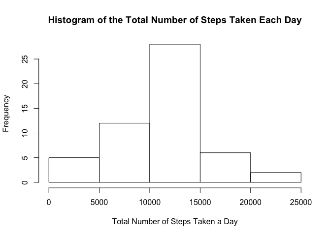
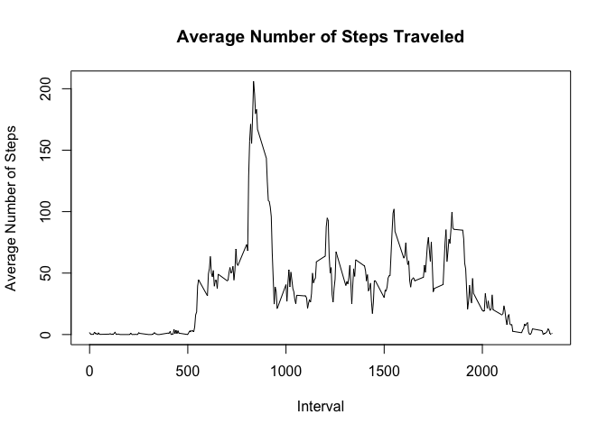
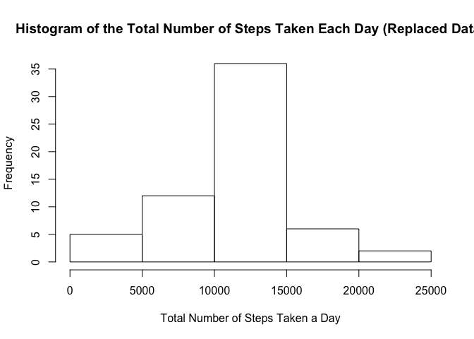
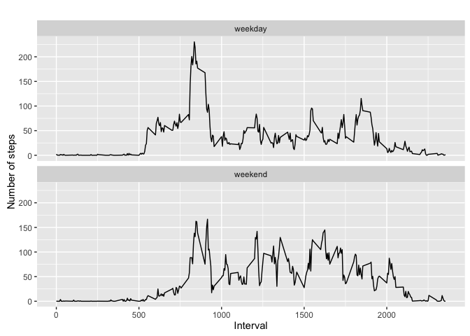

# Reproducible Research: Peer Assessment 1
# Reproducible Research: Project 1

##Introduction
This assignment makes use of data from a personal activity monitoring device. This device collects data at 5 minute intervals through out the day. The data consists of two months of data from an anonymous individual collected during the months of October and November, 2012 and include the number of steps taken in 5 minute intervals each day.

##Data
**Dataset** Available here: [https://d396qusza40orc.cloudfront.net/repdata%2Fdata%2Factivity.zip](https://d396qusza40orc.cloudfront.net/repdata%2Fdata%2Factivity.zip)

**Fileformat** CSV

17,568 observations

**Variables:**

* _steps_: Number of steps taking in a 5-minute interval (missing values are coded as NA)

* _date_: The date on which the measurement was taken in YYYY-MM-DD format

* _interval_: Identifier for the 5-minute interval in which measurement was taken


##Libraries used 

```r
library(knitr)
library(dplyr)
```

```
## 
## Attaching package: 'dplyr'
```

```
## The following objects are masked from 'package:stats':
## 
##     filter, lag
```

```
## The following objects are masked from 'package:base':
## 
##     intersect, setdiff, setequal, union
```

```r
library(ggplot2)
```

```
## Warning: package 'ggplot2' was built under R version 3.2.3
```
##Loading and preprocessing the data

```r
rawdata <- read.csv("activity.csv")
activitydata <- rawdata[complete.cases(rawdata),]
```
## What is the average daily activity pattern?

```r
totalStepsPerDay <- aggregate(steps ~ date, activitydata, sum)
hist(totalStepsPerDay$steps, main = "Histogram of the Total Number of Steps Taken Each Day", xlab = "Total Number of Steps Taken a Day")
```



```r
mean(totalStepsPerDay$steps)
```

```
## [1] 10766.19
```

```r
median(totalStepsPerDay$steps)
```

```
## [1] 10765
```
## What is the average daily activity pattern?

```r
stepsTraveled <- aggregate(steps ~ interval, activitydata, mean)
plot(stepsTraveled$interval, stepsTraveled$steps, type ="l", main = "Average Number of Steps Traveled", xlab = "Interval", ylab = "Average Number of Steps")
```


On average across all the days in the dataset, the 5-minute interval contains
the maximum number of steps?

```r
stepsTraveled$interval[which.max(stepsTraveled$steps)]
```

```
## [1] 835
```
## Imputing missing values
There are many days/intervals where there are missing values (coded as `NA`). The presence of missing days may introduce bias into some calculations or summaries of the data.

```r
#Missing numbers
totalMissingData <- sum(is.na(rawdata))
##Replacing NA’s with the mean for that 5-minute interval.
replaceddata <- rawdata
for (i in 1:nrow(replaceddata)) {
  if (is.na(replaceddata$steps[i])) {
    interval <- replaceddata[i,"interval"]
    replaceddata[i,"steps"] <- stepsTraveled[(which(stepsTraveled$interval == interval)),"steps"]
  }
}
#Histogram of the total number of steps taken each day
replacedTotalStepsPerDay <- aggregate(steps ~ date, replaceddata, sum)
hist(replacedTotalStepsPerDay$steps, main = "Histogram of the Total Number of Steps Taken Each Day (Replaced Data)", xlab = "Total Number of Steps Taken a Day")
```



```r
#The mean and median total number of steps taken per day
mean(replacedTotalStepsPerDay$steps)
```

```
## [1] 10766.19
```

```r
median(replacedTotalStepsPerDay$steps)
```

```
## [1] 10766.19
```
Mean and median values are higher after imputing missing data. The reason is
that in the original data, there are some days with `steps` values `NA` for 
any `interval`. The total number of steps taken in such days are set to 0s by
default. However, after replacing missing `steps` values with the mean `steps`
of associated `interval` value, these 0 values are removed from the histogram
of total number of steps taken each day.
## Are there differences in activity patterns between weekdays and weekends?
First, create a new factor variable in the dataset with two levels -- "weekday" and "weekend" indicating whether a given date is a weekday or weekend day.

```r
weekdayMeasures <- weekdays(as.Date(replaceddata$date))
weekdayMeasures[weekdayMeasures %in% c('Saturday','Sunday')] <- "weekend"
weekdayMeasures[weekdayMeasures != "weekend"] <- "weekday"
replaceddata["dayType"] <- weekdayMeasures
```
Now, let's make a panel plot containing plots of average number of steps taken
on weekdays and weekends.

```r
replaceddata$dayType <- as.factor(replaceddata$dayType)
replacedStepTraveled <- aggregate(steps ~ interval + dayType, replaceddata, mean)
qplot(interval, steps,geom=c("line"), data = replacedStepTraveled,xlab = "Interval", ylab = "Number of steps", main = "") +
facet_wrap(~ dayType, ncol = 1)
```


